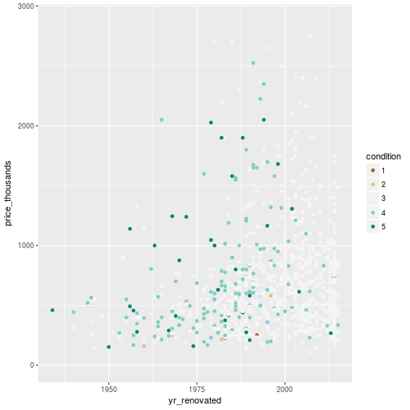

King County Houses Exploration by Nadiya Sitdykova
========================================================


This report explores a dataset containing prices and attributes for approximately 22,000 houses.


```
## Error in eval(expr, envir, enclos): could not find function "month"
```

```
## Error in eval(expr, envir, enclos): could not find function "day"
```

```
## Error in `$<-.data.frame`(`*tmp*`, "day", value = structure(integer(0), .Label = c("1", : replacement has 0 rows, data has 21613
```

```
## Error in `$<-.data.frame`(`*tmp*`, "month", value = structure(integer(0), .Label = c("1", : replacement has 0 rows, data has 21613
```
# Univariate Plots Section

```
## [1] 21613    13
```


```
## 'data.frame':	21613 obs. of  13 variables:
##  $ date                 : Factor w/ 372 levels "20140502T000000",..: 165 221 291 221 284 11 57 252 340 306 ...
##  $ price                : num  221900 538000 180000 604000 510000 ...
##  $ bedrooms             : int  3 3 2 4 3 4 3 3 3 3 ...
##  $ bathrooms            : num  1 2.25 1 3 2 4.5 2.25 1.5 1 2.5 ...
##  $ sqft_living          : int  1180 2570 770 1960 1680 5420 1715 1060 1780 1890 ...
##  $ sqft_lot             : int  5650 7242 10000 5000 8080 101930 6819 9711 7470 6560 ...
##  $ waterfront           : Ord.factor w/ 2 levels "0"<"1": 1 1 1 1 1 1 1 1 1 1 ...
##  $ view                 : Ord.factor w/ 5 levels "0"<"1"<"2"<"3"<..: 1 1 1 1 1 1 1 1 1 1 ...
##  $ condition            : Ord.factor w/ 5 levels "1"<"2"<"3"<"4"<..: 3 3 3 5 3 3 3 3 3 3 ...
##  $ yr_built             : int  1955 1951 1933 1965 1987 2001 1995 1963 1960 2003 ...
##  $ yr_renovated         : int  0 1991 0 0 0 0 0 0 0 0 ...
##  $ price_thousands      : num  222 538 180 604 510 ...
##  $ yr_build_or_renovated: int  2015 2015 2015 2015 2015 2015 2015 2015 2015 2015 ...
```

Our dataset consists of 21 variables, with almost 22,000 observations.


```
##               date           price            bedrooms     
##  20140623T000000:  142   Min.   :  75000   Min.   : 0.000  
##  20140625T000000:  131   1st Qu.: 321950   1st Qu.: 3.000  
##  20140626T000000:  131   Median : 450000   Median : 3.000  
##  20140708T000000:  127   Mean   : 540088   Mean   : 3.371  
##  20150427T000000:  126   3rd Qu.: 645000   3rd Qu.: 4.000  
##  20150325T000000:  123   Max.   :7700000   Max.   :33.000  
##  (Other)        :20833                                     
##    bathrooms      sqft_living       sqft_lot       waterfront view     
##  Min.   :0.000   Min.   :  290   Min.   :    520   0:21450    0:19489  
##  1st Qu.:1.750   1st Qu.: 1427   1st Qu.:   5040   1:  163    1:  332  
##  Median :2.250   Median : 1910   Median :   7618              2:  963  
##  Mean   :2.115   Mean   : 2080   Mean   :  15107              3:  510  
##  3rd Qu.:2.500   3rd Qu.: 2550   3rd Qu.:  10688              4:  319  
##  Max.   :8.000   Max.   :13540   Max.   :1651359                       
##                                                                        
##  condition    yr_built     yr_renovated    price_thousands 
##  1:   30   Min.   :1900   Min.   :   0.0   Min.   :  75.0  
##  2:  172   1st Qu.:1951   1st Qu.:   0.0   1st Qu.: 321.9  
##  3:14031   Median :1975   Median :   0.0   Median : 450.0  
##  4: 5679   Mean   :1971   Mean   :  84.4   Mean   : 540.1  
##  5: 1701   3rd Qu.:1997   3rd Qu.:   0.0   3rd Qu.: 645.0  
##            Max.   :2015   Max.   :2015.0   Max.   :7700.0  
##                                                            
##  yr_build_or_renovated
##  Min.   :2015         
##  1st Qu.:2015         
##  Median :2015         
##  Mean   :2015         
##  3rd Qu.:2015         
##  Max.   :2015         
## 
```


Above is original and transformed data. As an original plot has a long tail, logarithmic trahsformations was appplied for better understanding of the price distribution. The tranformed price distribution appears to be approximately normal with the price peaking around 450 thousands. Now let's see how this plot looks like across the categorical variables of waterfornt, view and condition.


As we can see, the most houses are not overlooking the waterfront and have view graded as zero. Condition is skewed to the right, with most houses of condition 3 and greater. Also interesting to look at the distribution of day and month when house was sold.


```
## Error in eval(expr, envir, enclos): object 'month' not found
```


```
## Error in eval(expr, envir, enclos): object 'day' not found
```


The month data has a peak around May, and have significantly lower count of sold houses in the beginning of the year. Distribution of days looks uniform, with significantly low value at 31st. But this could be explained by absense of 31st in about a half of months, so no surprise here.


```
##    Min. 1st Qu.  Median    Mean 3rd Qu.    Max. 
##   0.000   3.000   3.000   3.371   4.000  33.000
```


```
## 
##    0    1    2    3    4    5    6    7    8    9   10   11   33 
##   13  199 2760 9824 6882 1601  272   38   13    6    3    1    1
```
The smaller houses has 0 bedrooms and the largest one has 33 bedrooms (wow!). The plots above exclude the house with 33 bedrooms as it's clearly an outlier. All houses has whole number of bedrooms and most popular are houses with 3 bedrooms.


```
##    Min. 1st Qu.  Median    Mean 3rd Qu.    Max. 
##   0.000   1.750   2.250   2.115   2.500   8.000
```


```
## 
##    0  0.5 0.75    1 1.25  1.5 1.75    2 2.25  2.5 2.75    3 3.25  3.5 3.75 
##   10    4   72 3852    9 1446 3048 1930 2047 5380 1185  753  589  731  155 
##    4 4.25  4.5 4.75    5 5.25  5.5 5.75    6 6.25  6.5 6.75  7.5 7.75    8 
##  136   79  100   23   21   13   10    4    6    2    2    2    1    1    2
```
The maximal nuber of bathrooms is 8 and all values of bathrooms are multiplies of 0.25. Most popular houses have 2.5 bathrooms. What is suspicious, that is a ten houses with zero bathrooms. Let's look at this houses closer.

```
##                  date   price bedrooms bathrooms sqft_living sqft_lot
## 876   20140612T000000 1095000        0         0        3064     4764
## 1150  20150217T000000   75000        1         0         670    43377
## 3120  20150205T000000  380000        0         0        1470      979
## 5833  20141104T000000  280000        1         0         600    24501
## 6995  20140624T000000 1295650        0         0        4810    28008
## 9774  20150429T000000  355000        0         0        2460     8049
## 9855  20141223T000000  235000        0         0        1470     4800
## 10482 20140918T000000  484000        1         0         690    23244
## 14424 20150413T000000  139950        0         0         844     4269
## 19453 20140926T000000  142000        0         0         290    20875
##       waterfront view condition yr_built yr_renovated price_thousands
## 876            0    2         3     1990            0         1095.00
## 1150           0    0         3     1966            0           75.00
## 3120           0    2         3     2006            0          380.00
## 5833           0    0         2     1950            0          280.00
## 6995           0    0         3     1990            0         1295.65
## 9774           0    0         3     1990            0          355.00
## 9855           0    0         3     1996            0          235.00
## 10482          0    0         4     1948            0          484.00
## 14424          0    0         4     1913            0          139.95
## 19453          0    0         1     1963            0          142.00
##       yr_build_or_renovated
## 876                    2015
## 1150                   2015
## 3120                   2015
## 5833                   2015
## 6995                   2015
## 9774                   2015
## 9855                   2015
## 10482                  2015
## 14424                  2015
## 19453                  2015
```
I guess it is what it is: some houses don't have bathrooms. Other information about those houses looks valid.


```
##    Min. 1st Qu.  Median    Mean 3rd Qu.    Max. 
##     290    1427    1910    2080    2550   13540
```
Above is original and transformed data. As an original plot has a long tail, logarithmic trahsformations was appplied for better understanding of the living area distribution. Most houses have a living area between 1400 sqft and 2600 sqft: median 1910 sqft and mean 2080 sqft.


```
##    Min. 1st Qu.  Median    Mean 3rd Qu.    Max. 
##     520    5040    7618   15110   10690 1651000
```
And again, we applied logarithmic trahsformation to the lot area. Most houses have a lot area between 5040 sqft and 10690 sqft: median 7618 sqft and mean 15110 sqft.


```
##    Min. 1st Qu.  Median    Mean 3rd Qu.    Max. 
##    1900    1951    1975    1971    1997    2015
```

Interestingly, this plot in some degree shows economic situation in the country. For example we can see the lowest values around 1930 (Great Depression) and drop around 2008 (Financial Crisis). Significantly low value for 2015 can be explained by the fact, that data collected from May 2014 to May 2015. Most houses was built between 1975 and 1997.


```
## 
##     0  1934  1940  1944  1945  1946  1948  1950  1951  1953  1954  1955 
## 20699     1     2     1     3     2     1     2     1     3     1     3 
##  1956  1957  1958  1959  1960  1962  1963  1964  1965  1967  1968  1969 
##     3     3     5     1     4     2     4     5     5     2     8     4 
##  1970  1971  1972  1973  1974  1975  1976  1977  1978  1979  1980  1981 
##     9     2     4     5     3     6     3     8     6    10    11     5 
##  1982  1983  1984  1985  1986  1987  1988  1989  1990  1991  1992  1993 
##    11    18    18    17    17    18    15    22    25    20    17    19 
##  1994  1995  1996  1997  1998  1999  2000  2001  2002  2003  2004  2005 
##    19    16    15    15    19    17    35    19    22    36    26    35 
##  2006  2007  2008  2009  2010  2011  2012  2013  2014  2015 
##    24    35    18    22    18    13    11    37    91    16
```


```
##    Min. 1st Qu.  Median    Mean 3rd Qu.    Max. 
##    1934    1987    2000    1996    2007    2015
```

I excluded data for not renovated houses in second plot in order to zoom in for data around 2000. We can see that a lot of renovations was made in 2014, which is understandable: owners renovated their old houses right before sale. Amongst renovated houses most of them were renovated between 1987 and 2007: median 2000 and mean 1996.

# Univariate Analysis

### What is the structure of your dataset?
There are 21,613 houses in the dataset with 10 features (date, price, bedrooms, bathrooms, sqft_living, sqft_lot, waterfront, view, condition, yr_built, yr_renovated). The variables waterfront, view, and condition, are ordered factor variables with the following levels.

(worst) —————-> (best)

waterfront: 0, 1

view: 0, 1, 2, 3, 4

condition: 1, 2, 3, 4, 5

Other observations:

*

*

*

*

*

### What is/are the main feature(s) of interest in your dataset?
The main features of interest in the dataset is price. I’d like to determine which features are best for predicting the price of a house. I suspect some combination of the variables can be used to build a predictive model to price houses.

### What other features in the dataset do you think will help support your investigation into your feature(s) of interest?
View, condition, bedrooms, sqft_living, sqft_lot and yr_build are likely contribute to the price of a house. I think sqft_living, condition and yr_build contribute most to the price after researching information on house prices. One of the most importat things in house pricing is location. But I decided to exclude this variable as the all data is from the same county.

### Did you create any new variables from existing variables in the dataset?
I created two variable for the day and month of purchase of using the information from date. I've heard that during winter prices are lower, so it was particulary interesting for me to check this.

### Of the features you investigated, were there any unusual distributions? Did you perform any operations on the data to tidy, adjust, or change the form of the data? If so, why did you do this?

I log-transformed the right skewed price, sqft_living and sqft_lot ditstributions. 

# Bivariate Plots Section


The numbers of bedrooms and bathrooms tend to correlate with each other. The greater number of bathrooms or bedrooms, then the larger the whole living area of the house. Price correlates strongly with living area and number of bathrooms and bedrooms.

From this data, sqft_lot, yr_built and yr_renovated do not seem to have significatn correlations with price, but year when house was built moderately correlates with number of bathrooms and living area. I want to look closer at scatter plots involving price and some other variables like sqft_living, sqft_lot, bedrooms, bathrooms, yr_built, yr_renovated.


```
## `geom_smooth()` using method = 'gam'
```


As living area increases, the variance in price increases. The most houses represent a cloud with a high density below 700 thousands price. The relationship between price and sqft_living appears to be linear.


There is no much correlation between price and sqft_lot, but we can see some vertical bands where many houses with the same lot area have different price points. This bands could be explained by estimating lot area with the round values.


```
## 
## 	Pearson's product-moment correlation
## 
## data:  bedrooms and price_thousands
## t = 47.651, df = 21611, p-value < 2.2e-16
## alternative hypothesis: true correlation is not equal to 0
## 95 percent confidence interval:
##  0.2962354 0.3203646
## sample estimates:
##       cor 
## 0.3083496
```

Again, the tall vertical strips indicate bedrooms numbers are integers. Adding jitter, transparency, and changing the plot limits lets us see the slight correlation between bedrooms and price.


```
## `geom_smooth()` using method = 'gam'
```


```
## 
## 	Pearson's product-moment correlation
## 
## data:  bathrooms and price_thousands
## t = 90.714, df = 21611, p-value < 2.2e-16
## alternative hypothesis: true correlation is not equal to 0
## 95 percent confidence interval:
##  0.5154140 0.5347258
## sample estimates:
##       cor 
## 0.5251375
```


Then again, the tall vertical strips indicate bathrooms numbers are multiplies 0.25. Adding jitter, transparency, and changing the plot limits lets us see the correlation between bathrooms and price.


We can see two outliers with price over 4000 before 1950 and significantly more houses with extremely high price built after 1975. Adding transparency and adjusting limits didn't reveal any strong patterns. We can see that medain and mean stays approximately same for different yr_built. But what is clear, is that most houses was built after 1950, as we can see there are more points there.


Amongst renovated houses we can see weak correlation between price and yr_renovated. Also form this plot it's clear that most houses was renovated recently.

Next, I’ll look at how the categorical features vary with sqft_living and price.

In general houses with waterfront seems to have larger living area.


```
## 
## 	Spearman's rank correlation rho
## 
## data:  price_thousands and as.numeric(waterfront)
## S = 1.489e+12, p-value < 2.2e-16
## alternative hypothesis: true rho is not equal to 0
## sample estimates:
##       rho 
## 0.1150893
```

Houses with waterfront seems to have a higher price, but we also should remember that in could be partially result of larger living area. Variation of price is higher for houses with waterfront. Spearman's coefficient shows us that correlation is very weak.


There is a tendency that houses with better view have larger living area.


```
## 
## 	Spearman's rank correlation rho
## 
## data:  price_thousands and as.numeric(view)
## S = 1.1881e+12, p-value < 2.2e-16
## alternative hypothesis: true rho is not equal to 0
## sample estimates:
##       rho 
## 0.2939312
```

Houses with better view seems to have higher price, but then again, we should'n forget about posible effect of larger living area.
Variation of price have a tendency to increase with better levels of view. Spearmans rank shows us the a weak correlation.


```
## condition: 1
##    Min. 1st Qu.  Median    Mean 3rd Qu.    Max. 
##     290     820    1000    1216    1490    3080 
## -------------------------------------------------------- 
## condition: 2
##    Min. 1st Qu.  Median    Mean 3rd Qu.    Max. 
##     390     975    1320    1410    1700    5440 
## -------------------------------------------------------- 
## condition: 3
##    Min. 1st Qu.  Median    Mean 3rd Qu.    Max. 
##     380    1460    1970    2149    2660   13540 
## -------------------------------------------------------- 
## condition: 4
##    Min. 1st Qu.  Median    Mean 3rd Qu.    Max. 
##     390    1370    1820    1951    2350   12050 
## -------------------------------------------------------- 
## condition: 5
##    Min. 1st Qu.  Median    Mean 3rd Qu.    Max. 
##     370    1430    1880    2023    2440    7710
```

It seems that houses with poor condition (below 3) have smaller living area, but for other conditions sqft_living distributions are similar. Although condition 3 have highest median and 25%, 75% quantiles. 


```
## condition: 1
##    Min. 1st Qu.  Median    Mean 3rd Qu.    Max. 
##    78.0   160.0   262.5   334.4   431.1  1500.0 
## -------------------------------------------------------- 
## condition: 2
##    Min. 1st Qu.  Median    Mean 3rd Qu.    Max. 
##    80.0   189.8   279.0   327.3   397.3  2555.0 
## -------------------------------------------------------- 
## condition: 3
##    Min. 1st Qu.  Median    Mean 3rd Qu.    Max. 
##    75.0   329.5   450.0   542.0   640.0  7062.0 
## -------------------------------------------------------- 
## condition: 4
##    Min. 1st Qu.  Median    Mean 3rd Qu.    Max. 
##    89.0   305.0   440.0   521.2   625.0  7700.0 
## -------------------------------------------------------- 
## condition: 5
##    Min. 1st Qu.  Median    Mean 3rd Qu.    Max. 
##   110.0   350.0   526.0   612.4   725.0  3650.0
```


```
## 
## 	Spearman's rank correlation rho
## 
## data:  price_thousands and as.numeric(condition)
## S = 1.6515e+12, p-value = 0.006561
## alternative hypothesis: true rho is not equal to 0
## sample estimates:
##        rho 
## 0.01848996
```

Here we see the similar to living area picture. First two conditions have lower price, but other conditions are not very different. Although excellent condition(5) has highest quartiles for price. Spearmans rank shows us very weak correlation.


```
## Error in eval(expr, envir, enclos): object 'month' not found
```


It seems that living area have similar distributions during different month, but let's zoom in.


```
## Error in eval(expr, envir, enclos): object 'month' not found
```


```
## Error in by.default(sqft_living, month, summary): object 'month' not found
```

The highest living area median is in July (1950 sqft) and the lowest median is in February(1830 sqft). But actually 120 sqft is not much difference for houses, so I woudn't say that living area isn't similar by months.


```
## Error in eval(expr, envir, enclos): object 'month' not found
```


Let's zoom in

```
## Error in eval(expr, envir, enclos): object 'month' not found
```


```
## Error in by.default(price_thousands, month, summary): object 'month' not found
```


```
## Error in cor.test.default(price_thousands, as.numeric(month), method = "spearman", : object 'month' not found
```

Then again, the highest median price is in June and July (465 thousands) and the lowest median price is in February (425.5 thousands). In general there is kind of peak in summer and slight price drop in winter. So, I guess, seasons affect the price very slightly, if at all. Spearmans rank shows us very weak correlation.

# Bivariate Analysis

### Talk about some of the relationships you observed in this part of the investigation. How did the feature(s) of interest vary with other features in the dataset?

Price correlates strongly with living area and number of bathrooms. Also price slightly correlates with number of bedrooms. I found this interesting, that number of bathrooms correlates with price stronger, than with number of bathrooms.

As living area increases, the variance in price increases. In the plot of price vs sqft_living The most houses represent a cloud with a high density below 700 thousands price. The relationship between price and sqft_living appears to be exponential rather than linear.

From this data, sqft_lot, yr_built and yr_renovated do not seem to have significatn correlations with price, but year when house was built moderately correlates with number of bathrooms and living area.

Houses overlooking waterfrong have much higher median price than houses without waterfront. Also price variance is higher for houses with waterfront.

Houses with better levels of view and condition tend to occur more often at lower prices while houses with worse levels of view and condition tend to occur more often at higher prices.

Houses in condition 3 out of 5 have the highes median living area. The median price for condition 4 is lower than for condition 3, which is interesting.

Variation of price have a tendency to increase with better levels of view and then decrease for excellent view (4).

The highest median price is in June and July and the lowest median price is in February. The median price is typically lower in winter and higher in summber.

### Did you observe any interesting relationships between the other features (not the main feature(s) of interest)?

The numbers of bedrooms and bathrooms tend to correlate with each other. The greater number of bathrooms or bedrooms, then the larger the whole living area of the house which makes sense.

### What was the strongest relationship you found?

The price of a house is positively and strongly correlated with living area. Number of bedrooms and bathrooms correlate with the price, but less strongly than living area. Variable sqft_living could be used in a model to make house price predictions. But we shouldn't use bathrooms and bedrooms then, because they measuring the same quality and show strong correlation with sqft_living.


# Multivariate Plots Section
. Let’s now take a look at price / sqft living in order to avoid possible influence of sqft_living to the price.


```
## waterfront: 0
##    Min. 1st Qu.  Median    Mean 3rd Qu.    Max. 
##   87.59  181.80  243.90  262.30  316.70  810.10 
## -------------------------------------------------------- 
## waterfront: 1
##    Min. 1st Qu.  Median    Mean 3rd Qu.    Max. 
##   117.7   365.8   519.1   508.1   646.0   800.0
```
Median price per sqft for houses with waterfront is twice higher than median price per sqft for houses without waterfront. Variance of price/sqft is also higher for houses with waterfront. Although both minimums and maximums are close.


```
## view: 0
##    Min. 1st Qu.  Median    Mean 3rd Qu.    Max. 
##   87.59  178.90  239.30  256.90  309.10  810.10 
## -------------------------------------------------------- 
## view: 1
##    Min. 1st Qu.  Median    Mean 3rd Qu.    Max. 
##   103.6   227.8   297.9   319.9   384.7   727.1 
## -------------------------------------------------------- 
## view: 2
##    Min. 1st Qu.  Median    Mean 3rd Qu.    Max. 
##    89.2   215.2   285.2   304.3   363.0   756.6 
## -------------------------------------------------------- 
## view: 3
##    Min. 1st Qu.  Median    Mean 3rd Qu.    Max. 
##   97.04  227.90  298.40  322.50  391.10  758.40 
## -------------------------------------------------------- 
## view: 4
##    Min. 1st Qu.  Median    Mean 3rd Qu.    Max. 
##   126.4   309.1   406.0   434.8   564.1   800.0
```

The picture now is not so monotonic as it was for a full price. The median price/sqft for view 2 violates the pattern, as it's lower than median for worse view 1.


```
## condition: 1
##    Min. 1st Qu.  Median    Mean 3rd Qu.    Max. 
##   95.38  149.40  246.80  290.40  393.30  785.30 
## -------------------------------------------------------- 
## condition: 2
##    Min. 1st Qu.  Median    Mean 3rd Qu.    Max. 
##   88.79  156.20  210.60  244.60  304.70  792.70 
## -------------------------------------------------------- 
## condition: 3
##    Min. 1st Qu.  Median    Mean 3rd Qu.    Max. 
##   87.59  179.80  239.30  257.40  305.00  810.10 
## -------------------------------------------------------- 
## condition: 4
##    Min. 1st Qu.  Median    Mean 3rd Qu.    Max. 
##   88.08  181.60  250.00  270.90  329.40  792.10 
## -------------------------------------------------------- 
## condition: 5
##    Min. 1st Qu.  Median    Mean 3rd Qu.    Max. 
##    88.0   212.3   284.7   299.0   363.9   758.4
```

From condition 2 the better conditions have higher median price per sqft. But condition 1 has median price/sqft higher than condition 2 and 3. Also price/sqft has a largest variance for houses in condition 1.


```
## Error in eval(expr, envir, enclos): object 'month' not found
```


```
## Error in eval(expr, envir, enclos): object 'month' not found
```


Here we can see the price/sqft median bump in April and then slight decrese from Novermber to January. Variance in each month is approximately the same.


Most houses have a condition level 3 and higher. Interestingly, almost all houses built after 2000 seems to be in condition 3. The pattern holds across each level of view and each level of waterfront.


View and waterfront are not correlated with yr_built, nothing particularly stands out.




`
Condition, view and waterfront are not correlated with yr_renovated, nothing particularly stands out.


If we account for constant sqft_living value, better view produces a higher-priced house.


The pattern is not noticeable here.

The last 3 plots suggest that we can build a linear model and use those variables in the linear model to predict the price of a house.

```
## 
## Calls:
## m1: lm(formula = I(price_thousands) ~ I(sqft_living), data = kc_house)
## m2: lm(formula = I(price_thousands) ~ I(sqft_living) + view, data = kc_house)
## m3: lm(formula = I(price_thousands) ~ I(sqft_living) + condition, 
##     data = kc_house)
## m4: lm(formula = I(price_thousands) ~ I(sqft_living) + condition + 
##     waterfront, data = kc_house)
## 
## ==================================================================================
##                         m1              m2              m3              m4        
## ----------------------------------------------------------------------------------
##   (Intercept)       -43.581***      212.040***      -27.098*        387.488***    
##                      (4.403)         (7.053)        (10.927)        (14.491)      
##   I(sqft_living)      0.281***        0.256***        0.283***        0.274***    
##                      (0.002)         (0.002)         (0.002)         (0.002)      
##   view: .L                          406.807***                                    
##                                     (10.608)                                      
##   view: .Q                          161.039***                                    
##                                      (9.799)                                      
##   view: .C                          168.081***                                    
##                                     (11.912)                                      
##   view: ^4                          -17.783                                       
##                                     (10.273)                                      
##   condition: .L                                      44.544          60.629*      
##                                                     (30.945)        (29.780)      
##   condition: .Q                                      78.862**        62.496*      
##                                                     (26.163)        (25.179)      
##   condition: .C                                     -10.159          -3.717       
##                                                     (19.762)        (19.017)      
##   condition: ^4                                       5.374           5.529       
##                                                     (11.311)        (10.884)      
##   waterfront: .L                                                    581.195***    
##                                                                     (13.978)      
## ----------------------------------------------------------------------------------
##   R-squared                0.493           0.544           0.500           0.537  
##   adj. R-squared           0.493           0.544           0.499           0.536  
##   sigma                  261.453         247.899         259.748         249.947  
##   F                    21001.910        5158.575        4313.423        4170.087  
##   p                        0.000           0.000           0.000           0.000  
##   Log-likelihood     -150969.968     -149817.482     -150826.577     -149994.751  
##   Deviance        1477276362.322  1327838743.649  1457803810.225  1349800084.782  
##   AIC                 301945.937      299648.965      301667.153      300005.502  
##   BIC                 301969.880      299704.832      301723.021      300069.350  
##   N                    21613           21613           21613           21613      
## ==================================================================================
```

Adding condition and waterfront to the model didn't improve it. Which isn't surprising, considering absence of the pattern on the plots. So the best version of model predicts price by sqft_living and view. This can account for 54.4% of the variance in the price of houses, which isn't much. I guess, some important factors was missed in this data. 

# Multivariate Analysis

### Talk about some of the relationships you observed in this part of the investigation. Were there features that strengthened each other in terms of looking at your feature(s) of interest?

For conditions 2-5 the better conditions have higher median price per sqft. But condition 1 has median price/sqft higher than condition 2 and 3. Also price/sqft has a largest variance for houses in condition 1.

Median price/sqft has bump in April and then slightly decrese from Novermber to January. Variance in each month is approximately the same. So I guess it's true that winter is the most profitable time to buy a property.

The last three plots from the Multivariate section suggest that I can build a linear model and use those variables in the model to predict the price of a house. The results of the model are summarized below.

### Were there any interesting or surprising interactions between features?

It was surprising for me that almost all houses built after 2000 seems to be in condition 3. I expected to see new houses in excellent condition, but data showed another pattern. This pattern holds across each level of view and each level of waterfront.

### OPTIONAL: Did you create any models with your dataset? Discuss the strengths and limitations of your model.

Yes, I created a linear model starting from the price and the sqft_living.

The variables in the linear model account for 54.4% of the variance in the price of houses. The addition of the view variable to the model improves the R^2 value by five percents, which is expected based on the visualization above of price vs sqft_living and view. Condition and waterfront didn't improve the model.

------

# Final Plots and Summary

### Plot One

### Description One
The distribution of house prices appears to be unimodal on log scale, with a price peak around 450 thousands dollars. Perhaps most people are looking for houses near this price point.

### Plot Two

```
## Error in eval(expr, envir, enclos): object 'month' not found
```


### Description Two
Here we can see the price/sqft median bump in April and then slight decrese from Novermber to January. Variance in each month is approximately the same. So from these picture it seems that winter is the most profitable time to buy a house.

### Plot Three


### Description Three

The plot indicates that a linear model could be constructed to predict the price of houses using price as the outcome variable and living area as the predictor variable. Holding living area constant, houses with higher view levels (0 is worst and 4 is best) are often cheaper than houses with better view to account for additional variability in prices.

------

# Reflection

The analyzed part of king county houses data set contains informtaion on almost __ houeses across _ variables from around 2014. 
I started by understending the distributions of individual variables in the data set,and then I explored interesting questions and leads as I continued to make observations on plots. Eventually, I explored the price of diamonds across many variables and created a linear model to predict house prices. 

There was a clear trend between the living area of houes and its price. I was surprised that year when was built a house didn't have strong posititve correaltion with price. But there was a correlation with categorical variables: view, condition and waterfront. I struggled understending why almost all houses built after 2000 had medium condition, but this became more clear when I realized that most of the data contained houses in medium condition. For the linear model, all houses were included since information on price, view, condition and waterfront were available for all the houses. 

Constructed model was able to account only for 54.4% of the variance in the dataset. So my thoughts here is that dataset didn't contain informtaion about important factors, which affect the house price. Perhaps, it wasn't wise to exclude zipcode from consideration, as actually even in the same county prices could depend on neiborhoods. Also proximity to highways or public transportation could affect the price. 

Moreover, the model could be much complicated than just a linear. I tried to take a log of price (because price distributions often has long tail) and square root of living area (as it's actually multiplication of two dimensions). But model with this variables without transformation showed better results so I decided to keep it as it is.

Even if someone will decide to use this model to predict the house price, he/she should keep in mind some limitations. This dataset represents houses sold in 2014 and now prices for the same houses definetely will be higher dut to changes in demand and supply or inflation rates. A more recent dataset would be better to make predictions of house prices and also it could be interesting to analyze more variables, which possibly could affect the price.
